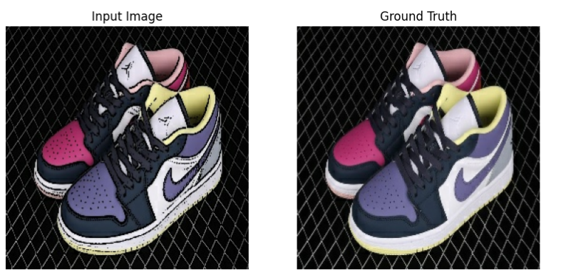
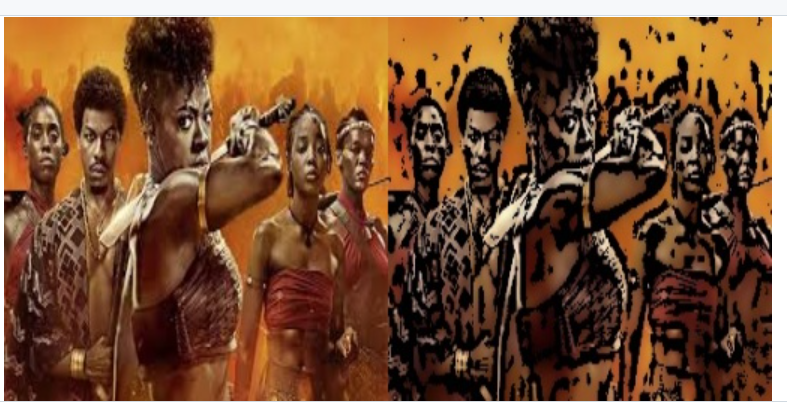

[](https://www.python.org/downloads/)
[](https://jupyter.org/install)
[](https://github.com/Tchouanga12/SAM-Quality_Control/graphs/contributors)

# Image Cartoonizer

This project has two main objectives:
1. **Cartoonize images using traditional computer vision techniques**.
2. **Train a Generative Adversarial Network (GAN)** to perform the same cartoonization task.

## Project Overview
The `image_cartoonizer` project provides tools to cartoonize images using traditional techniques and deep learning. The second approach involves training a GAN model (Pix2Pix) to automate the process.

Example 1:
<br>


Example 2:
<br>


## Project Structure

### `data/`
- **cartoonized_images/**: Set of images cartoonized by various methods.
- **cartoonized_with_cartoonizer_1/**: Images processed using the first cartoonization method.
- **cartoonized_with_cartoonizer_2/**: Images processed using the second cartoonization method.
- **groundtruth_images/**: Original images with transformed labels.
- **original_images/**: Raw, unprocessed images used in the project.
- **test/**: Cartoonized images for testing purposes.
- **train/**: Cartoonized images for training the GAN model.

### `log/`
- **cartoonize.log**: Logs the overall cartoonization process.
- **split_by_cartoonization.log**: Tracks the classification of images based on the cartoonization method used.
- **train_test_split.log**: Logs details of the train-test splitting process.

### `script/`
- **`utils.py`**: Contains helper functions, currently including one function.
- **`copy_and_rename.py`**: Renames images in `original_images/` to a standard format (e.g., `1.jpg`, `2.jpg`, etc.), saving them in `groundtruth_images/`.
- **`cartoonization_methods.py`**: Defines the available cartoonization methods (`cartoonizer_1`, `cartoonizer_2`).
- **`cartoonize.py`**: Applies random cartoonization methods on images from `groundtruth_images/` and stores the results in `cartoonized_images/`.
- **`split_by_cartoonization_method.py`**: Categorizes images from `cartoonized_images/` by the method used to create them.
- **`train_test_split.py`**: Prepares images for training the GAN by stacking original and cartoonized images horizontally, and splits them into training (80%) and test (20%) sets in the `train/` and `test/` directories.

### Jupyter Notebook
- **Image_to_cartoon_translation_with_a_conditional_GAN_(pix2pix).ipynb**: Contains the GAN model implementation for image-to-cartoon translation using the Pix2Pix architecture.

## Installation

1. Clone the repository:
   ```bash
   git clone https://github.com/Tchouanga12/image_cartoonizer.git
